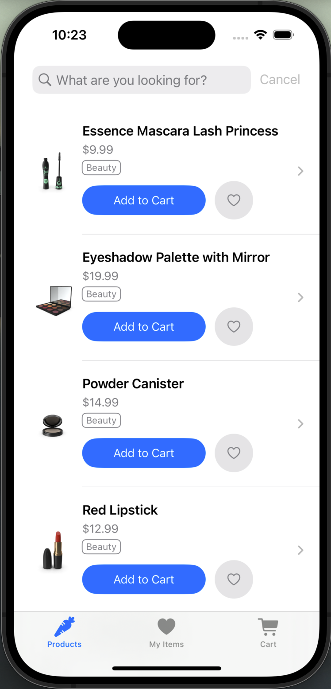

# iMarket iOS App

### Introduction

Welcome to the iMarket iOS app, a modern and user-friendly application designed for seamless shopping experiences. This app leverages the DummyJSON API to fetch and display product data, offering users an intuitive interface for browsing, searching, and managing products. The app includes features such as product search, favorites, and a shopping cart, all built using SwiftUI. Users can easily add items to their cart, mark favorites, and view detailed product information. The app is designed with a pixel-art-style theme, inspired by the aesthetics of Minecraft, providing a visually appealing and nostalgic shopping experience. Whether you're looking to browse products or manage your shopping cart, iMarket offers a smooth and engaging experience tailored to your needs.

### Screenshots

| View                     | Screenshot |
|--------------------------|------------|
| **Home View**            |  |
| **Search Results View**  |  |
| **Product Detail View**  |  |
| **Favorites View**       |  |
| **Cart View**            |  |
| **Search Bar Editing**   |  |
